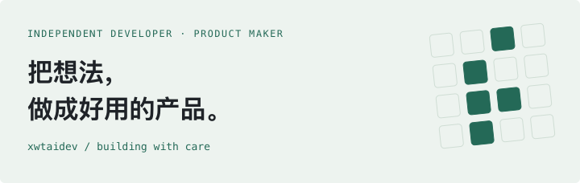
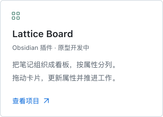
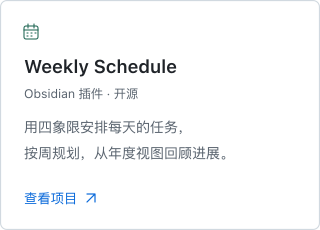
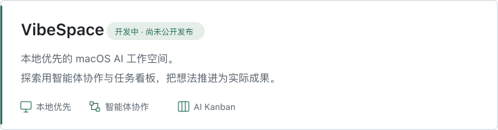

<picture>
  <source media="(max-width: 600px) and (prefers-color-scheme: dark)" srcset="assets/header-mobile-dark.svg">
  <source media="(max-width: 600px) and (prefers-color-scheme: light)" srcset="assets/header-mobile-light.svg">
  <source media="(prefers-color-scheme: dark)" srcset="assets/header-dark.svg">
  <source media="(prefers-color-scheme: light)" srcset="assets/header-light.svg">
  
</picture>

### 你好，我是 xwtaidev。

独立开发者，正在创造 **AI 工具与个人效率产品**。 从 Obsidian 插件到桌面应用，让日常工作更顺手一点。

#### <samp>SELECTED WORK / 开源作品</samp>

  <a href="https://github.com/xwtaidev/obsidian-lattice-plugin">
    <picture>
      <source media="(max-width: 600px) and (prefers-color-scheme: dark)" srcset="assets/lattice-mobile-dark.svg">
      <source media="(max-width: 600px) and (prefers-color-scheme: light)" srcset="assets/lattice-mobile-light.svg">
      <source media="(prefers-color-scheme: dark)" srcset="assets/lattice-dark.svg">
      <source media="(prefers-color-scheme: light)" srcset="assets/lattice-light.svg">
      
    </picture>
  </a>
  <a href="https://github.com/xwtaidev/obsidian-weekly-schedule-plugin">
    <picture>
      <source media="(max-width: 600px) and (prefers-color-scheme: dark)" srcset="assets/weekly-schedule-mobile-dark.svg">
      <source media="(max-width: 600px) and (prefers-color-scheme: light)" srcset="assets/weekly-schedule-mobile-light.svg">
      <source media="(prefers-color-scheme: dark)" srcset="assets/weekly-schedule-dark.svg">
      <source media="(prefers-color-scheme: light)" srcset="assets/weekly-schedule-light.svg">
      
    </picture>
  </a>

#### <samp>BUILDING NOW / 正在构建</samp>

<picture>
  <source media="(max-width: 600px) and (prefers-color-scheme: dark)" srcset="assets/vibespace-mobile-dark.svg">
  <source media="(max-width: 600px) and (prefers-color-scheme: light)" srcset="assets/vibespace-mobile-light.svg">
  <source media="(prefers-color-scheme: dark)" srcset="assets/vibespace-dark.svg">
  <source media="(prefers-color-scheme: light)" srcset="assets/vibespace-light.svg">
  
</picture>

#### <samp>HOW I BUILD / 创作理念</samp>

> 从自己遇到的问题出发，做愿意每天使用的工具。
>
> 重视清楚的交互、可掌握的数据，以及一点点持续的改进。

技术与工具

TypeScript · React · Next.js · Tauri · Rust · Obsidian

[个人网站](https://xwtai.cn/) · [X / @xwtaidev](https://x.com/xwtaidev)

Small tools. Thoughtful work.
