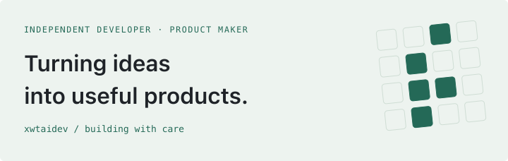
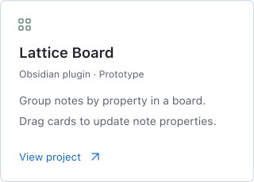
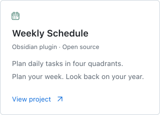
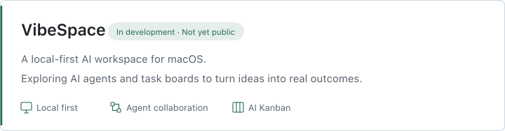

**English** · [简体中文](https://github.com/xwtaidev/xwtaidev/blob/main/README.zh-CN.md)

<picture>
  <source media="(max-width: 600px)" srcset="assets/en/header-mobile.svg">
  <source media="(prefers-color-scheme: dark)" srcset="assets/en/header-dark.svg">
  <source media="(prefers-color-scheme: light)" srcset="assets/en/header-light.svg">
  
</picture>

### Hi, I'm xwtaidev.

I'm an independent developer building **AI tools and personal productivity apps**. From Obsidian plugins to desktop apps, I make everyday work a little smoother.

#### <samp>SELECTED WORK</samp>

  <a href="https://github.com/xwtaidev/obsidian-lattice-plugin">
    <picture>
      <source media="(max-width: 600px)" srcset="assets/en/lattice-mobile.svg">
      <source media="(prefers-color-scheme: dark)" srcset="assets/en/lattice-dark.svg">
      <source media="(prefers-color-scheme: light)" srcset="assets/en/lattice-light.svg">
      
    </picture>
  </a>
  <a href="https://github.com/xwtaidev/obsidian-weekly-schedule-plugin">
    <picture>
      <source media="(max-width: 600px)" srcset="assets/en/weekly-schedule-mobile.svg">
      <source media="(prefers-color-scheme: dark)" srcset="assets/en/weekly-schedule-dark.svg">
      <source media="(prefers-color-scheme: light)" srcset="assets/en/weekly-schedule-light.svg">
      
    </picture>
  </a>

#### <samp>BUILDING NOW</samp>

<picture>
  <source media="(max-width: 600px)" srcset="assets/en/vibespace-mobile.svg">
  <source media="(prefers-color-scheme: dark)" srcset="assets/en/vibespace-dark.svg">
  <source media="(prefers-color-scheme: light)" srcset="assets/en/vibespace-light.svg">
  
</picture>

#### <samp>HOW I BUILD</samp>

> I start with problems I encounter and build tools I'd want to use every day.
>
> I care about clear interactions, data you control, and steady improvements.

Tech &amp; tools

TypeScript · React · Next.js · Tauri · Rust · Obsidian

[Website](https://xwtai.cn/) · [X / @xwtaidev](https://x.com/xwtaidev)

Small tools. Thoughtful work.
